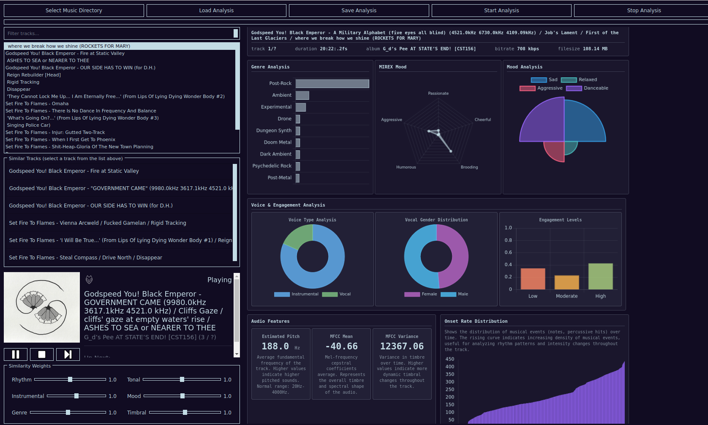

## conan
smol music recommendation engine based on local library folders. (**WORK IN PROGRESS**)



*ui is not final, screenshot from python branch*

- [conan](#conan)
- [how does the recommendation algorithm works?](#how-does-the-recommendation-algorithm-works)
- [features](#features)
- [download](#download)
  - [foobar2000](#foobar2000)
- [compile yourself](#compile-yourself)
  - [try package repos first](#try-package-repos-first)
  - [use clang](#use-clang)
  - [dependencies](#dependencies)
  - [things may help you in development](#things-may-help-you-in-development)
- [why](#why)
  - [why do you have `time.h` at include folder](#why-do-you-have-timeh-at-include-folder)
  - [why dont you use qtwebengine](#why-dont-you-use-qtwebengine)
  - [why did you create this project](#why-did-you-create-this-project)
- [problems, todos, and many more rants](#problems-todos-and-many-more-rants)
  - [windows toolchains (mingw, etc) does not work.](#windows-toolchains-mingw-etc-does-not-work)
- [closing thoughts](#closing-thoughts)

## how does the recommendation algorithm works?

i didnt do the math, [someone else did](https://www.researchgate.net/publication/351863177_Content-based_Music_Recommendation_System), and I tried my best to explain how it works with examples [in this header file](src/workers/analysis.h).

## features
WIP
## download
### foobar2000
install [beefweb from here](https://github.com/hyperblast/beefweb/releases/tag/v0.8). 
then from f2k, files -> settings -> tools -> beefweb remote control -> tick allow remote connections and set port.

settings WIP

## compile yourself
trust me, this is not worth your time. most depndencies are compiled from source, and it will take so much time from you, i am talking about several hours. if you follow these steps, and for uncertain reasons you decide to compile this application, you are my best friend from now on. 

### try package repos first

for QT and webkitgtk, try installing them from your package repository first. if they dont work, compile yourself.

### use clang
export the folloving envs
```bash
export CC=/usr/bin/clang-19
export CXX=/usr/bin/clang++-19
```
until we are done
### dependencies
<details>

<summary>libs</summary>

```bash
sudo add-apt-repository ppa:oibaf/graphics-drivers
sudo apt-get update
sudo apt-get install \
    libva-dev \
    libyaml-dev \
    libvdpau-dev \
    libx11-dev \
    libsamplerate0-dev \
    libprotobuf-dev \
    protobuf-compiler \
    libeigen3-dev \
    libfftw3-dev \
    libchromaprint-dev \
    libspdlog-dev \
    libfmt-dev \
    libtagc0-dev \
    libva-drm2 \
    libbz2-dev \
    liblzma-dev \
    uuid-dev \
    libcap-dev \
    libzmq3-dev \
    libpwquality-dev \
    libmemcached-dev \
    libjemalloc-dev \
    libutfcpp-dev \
    libssl-dev \
    uwsgi \
    zlib1g-dev \
    ruby-full \ 
    ccache
```

</details>

<details>

<summary>tensorflow</summary>

do NOT use versions above 2.13. **NEVER EVER CHANGE THE VERSION AND IF YOU CHANGE THE VERSION, I WILL BOOK THE FIRST FLIGHT TO YOUR HOME, STEAL ALL YOUR MCNUGGETS, AND FLY BACK HOME. I HAVE SPENT TWO WEEKS FIGURING OUT WHY, AND IF YOU STILL USE THE LATEST VERSION, I WILL DRINK THE LAST LIPTON ICE TEA BOTTLE IN YOUR FRIDGE.**

<details>

<summary>...but why?</summary>

tensorflow is NOT COMPATIBLE with any library. from their own website:

> Clang is a C/C++/Objective-C compiler that is compiled in C++ based on LLVM. It is the default compiler to build TensorFlow starting with TensorFlow 2.13. The current supported version is LLVM/Clang 17.

this means that, they are bringing LLVM symbols along with the library and it will not be compatible with ANYTHING.

```bash
* thread #1, name = 'mre', stop reason = signal SIGSEGV: address not mapped to object (fault address: 0x8)
  * frame #0: 0x00007fffcae00ff1 libtensorflow_framework.so.2`llvm::raw_svector_ostream::write_impl(char const*, unsigned long) + 17
    frame #1: 0x00007fffa345785e libLLVM-17.so.1`llvm::raw_ostream::write(char const*, unsigned long) + 366
    frame #2: 0x00007fffa3428e71 libLLVM-17.so.1`llvm::Twine::printOneChild(llvm::raw_ostream&, llvm::Twine::Child, llvm::Twine::NodeKind) const + 49
    frame #3: 0x00007fffa3428b8a libLLVM-17.so.1`___lldb_unnamed_symbol51694 + 202
    frame #4: 0x00007fffa34289e0 libLLVM-17.so.1`llvm::Twine::str[abi:cxx11]() const + 400
    frame #5: 0x00007fffa330a470 libLLVM-17.so.1`___lldb_unnamed_symbol50045 + 240
    frame #6: 0x00007ffff7fca71f ld-linux-x86-64.so.2`call_init(l=<unavailable>, argc=1, argv=0x00007fffffffdb08, env=0x00007fffffffdb18) at dl-init.c:74:3
    frame #7: 0x00007ffff7fca824 ld-linux-x86-64.so.2`_dl_init [inlined] call_init(env=<unavailable>, argv=<unavailable>, argc=<unavailable>, l=<unavailable>) at dl-init.c:120:14
    frame #8: 0x00007ffff7fca81f ld-linux-x86-64.so.2`_dl_init(main_map=0x0000555556d08890, argc=1, argv=0x00007fffffffdb08, env=0x00007fffffffdb18) at dl-init.c:121:5
    frame #9: 0x00007ffff7fc65b2 ld-linux-x86-64.so.2`__GI__dl_catch_exception(exception=0x0000000000000000, operate=(ld-linux-x86-64.so.2`call_dl_init at dl-open.c:527:1), args=0x00007fffffffbb30) at dl-catch.c:211:7
    frame #10: 0x00007ffff7fd1d7c ld-linux-x86-64.so.2`dl_open_worker [inlined] dl_open_worker(a=0x00007fffffffbce0) at dl-open.c:829:5
    frame #11: 0x00007ffff7fd1d50 ld-linux-x86-64.so.2`dl_open_worker(a=0x00007fffffffbce0) at dl-open.c:792:1
    frame #12: 0x00007ffff7fc651c ld-linux-x86-64.so.2`__GI__dl_catch_exception(exception=0x00007fffffffbcc0, operate=(ld-linux-x86-64.so.2`dl_open_worker at dl-open.c:793:1), args=0x00007fffffffbce0) at dl-catch.c:237:8
    frame #13: 0x00007ffff7fd2164 ld-linux-x86-64.so.2`_dl_open(file="/usr/lib/x86_64-linux-gnu/dri/zink_dri.so", mode=<unavailable>, caller_dlopen=0x00007fffb0e497d0, nsid=<unavailable>, argc=1, argv=0x00007fffffffdb08, env=0x00007fffffffdb18) at dl-open.c:905:17
    frame #14: 0x00007fffb8274194 libc.so.6`dlopen_doit(a=0x00007fffffffbf90) at dlopen.c:56:15
    frame #15: 0x00007ffff7fc651c ld-linux-x86-64.so.2`__GI__dl_catch_exception(exception=0x00007fffffffbed0, operate=(libc.so.6`dlopen_doit at dlopen.c:48:1), args=0x00007fffffffbf90) at dl-catch.c:237:8
    frame #16: 0x00007ffff7fc6669 ld-linux-x86-64.so.2`_dl_catch_error(objname=0x00007fffffffbf38, errstring=0x00007fffffffbf40, mallocedp=0x00007fffffffbf37, operate=<unavailable>, args=<unavailable>) at dl-catch.c:256:19
    frame #17: 0x00007fffb8273c73 libc.so.6`_dlerror_run(operate=<unavailable>, args=<unavailable>) at dlerror.c:138:17
    frame #18: 0x00007fffb827424f libc.so.6`___dlopen [inlined] dlopen_implementation(dl_caller=<unavailable>, mode=<unavailable>, file=<unavailable>) at dlopen.c:71:10
    frame #19: 0x00007fffb8274230 libc.so.6`___dlopen(file=<unavailable>, mode=<unavailable>) at dlopen.c:81:12
    frame #20: 0x00007fffb0e497d0 libGLX_mesa.so.0`___lldb_unnamed_symbol2895 + 208
    frame #21: 0x00007fffb0e4999e libGLX_mesa.so.0`___lldb_unnamed_symbol2896 + 46
    frame #22: 0x00007fffb0e26d5d libGLX_mesa.so.0`___lldb_unnamed_symbol2408 + 61
    frame #23: 0x00007fffb0e288d8 libGLX_mesa.so.0`___lldb_unnamed_symbol2452 + 120
    frame #24: 0x00007fffb0e2da71 libGLX_mesa.so.0`___lldb_unnamed_symbol2539 + 289
    frame #25: 0x00007fffb0e2eb19 libGLX_mesa.so.0`___lldb_unnamed_symbol2546 + 1097
    frame #26: 0x00007fffb0e2a0af libGLX_mesa.so.0`___lldb_unnamed_symbol2483 + 31
    frame #27: 0x00007fffb0e2ac49 libGLX_mesa.so.0`___lldb_unnamed_symbol2490 + 57
    frame #28: 0x00007fffb34fea7d libGLX.so.0`glXChooseFBConfig + 77
    frame #29: 0x00007fffb772520e libQt6Gui.so.6`qglx_findConfig(_XDisplay*, int, QSurfaceFormat, bool, int, int) + 238
    frame #30: 0x00007fffb0ea7e22 libqxcb-glx-integration.so`___lldb_unnamed_symbol504 + 258
    frame #31: 0x00007fffb0ea9131 libqxcb-glx-integration.so`___lldb_unnamed_symbol505 + 145
    frame #32: 0x00007fffb765e015 libQt6Gui.so.6`QOpenGLContext::create() + 53
    frame #33: 0x00007fffbc91d81f libQt6WebEngineCore.so.6`QtWebEngineCore::initialize() + 207
    frame #34: 0x00007fffc28ab6c2 libQt6Core.so.6`QCoreApplicationPrivate::init() + 1170
    frame #35: 0x00007fffb73f18ff libQt6Gui.so.6`QGuiApplicationPrivate::init() + 47
    frame #36: 0x00007fffc21bd985 libQt6Widgets.so.6`QApplicationPrivate::init() + 21
    frame #37: 0x00005555555551ec mre`main + 44
    frame #38: 0x00007fffb82061ca libc.so.6`__libc_start_call_main(main=(mre`main), argc=1, argv=0x00007fffffffdb08) at libc_start_call_main.h:58:16
    frame #39: 0x00007fffb820628b libc.so.6`__libc_start_main_impl(main=(mre`main), argc=1, argv=0x00007fffffffdb08, init=<unavailable>, fini=<unavailable>, rtld_fini=<unavailable>, stack_end=0x00007fffffffdaf8) at libc-start.c:360:3
    frame #40: 0x00005555555550f5 mre`_start + 37
  thread #2, name = 'QXcbEventQueue'
    frame #0: 0x00007fffb82f74cd libc.so.6`__GI___poll(fds=0x00007fffb16b9628, nfds=1, timeout=-1) at poll.c:29:10
    frame #1: 0x00007fffb663a8ca libxcb.so.1`___lldb_unnamed_symbol794 + 154
    frame #2: 0x00007fffb663c28c libxcb.so.1`xcb_wait_for_event + 108
    frame #3: 0x00007fffb17b37c0 libQt6XcbQpa.so.6`___lldb_unnamed_symbol2478 + 64
    frame #4: 0x00007fffc29eb48d libQt6Core.so.6`___lldb_unnamed_symbol11912 + 349
    frame #5: 0x00007fffb8278a94 libc.so.6`start_thread(arg=<unavailable>) at pthread_create.c:447:8
    frame #6: 0x00007fffb8305c3c libc.so.6`__clone3 at clone3.S:78
```

you will always encounter errors like this, even if you dont use the tensorflow, linking this library will be enough to segmentation fault everything, because, Google is using a mastermind engineering product Bazel, and they are bringing all the custom built libLLVM symbols to your application. if you stay below the 2.13,  you will still use the GCC built library, you wont need to build the entire library all over again, and, our app will work just fine anyways. 

you cannot isolate the llvm symbols brought by tensorflow, it is borderline impossible to isolate your own LLVM symbols coming from clang, and tensorflow's LLVM symbols when built by them.

*it is dumb*
*it is really cursed*

yes it is. nothing built by google has made a sense for the last 15 years.

some more rant from my twitter thread (heavily censored, because, uh.)


> day 14 progress: 
> still cannot run [talking about the project].
> maybe we will manage to run our app on day 15 who knows?

>  it is not just me, even debian maintainers are so sick of whatever the fuck google is doing
https://wiki.debian.org/MachineLearning/Tensorflow


> gentoo removed the support for tensorflow because the effort required to compile and build this absolute dumpster fire is absolutely not worth it 
https://bugs.gentoo.org/922374

> good news is I can actually compile and run my app. bad news is, if I interact with the webkit window, it crashes again, because, for some reason Google decides to bring all the LLVM with it. Bazel is not using the system libraries when you compile a library, Bazel is using random downloaded libraries so when you use a pre-built library there is no way in hell to know what actually got used when that library was built. So, yes, I can compile and run this application, but as soon as I interact with incompatible library, segfault.

> there is no documentation for bazel. there is no use case for bazel. it is built from google for google to give you headaches because that's what google does, their sole existence reason is to give you headaches and aneursyms

> at one point who thought it is a good idea to bring the entirety of LLVM with the library so that you can be incompatible with anything else that's not built with that specific LLVM used in bazel? we don't even know which LLVM they used because Bazel does not follow standards.

> *no comment*
https://github.com/kubernetes/kubernetes/pull/99561

> every library in the ecosystem is compatible with each other, let it be built with CLang or GCC, only tensorflow is not compatible with anything because they bring the libLLVM 18 symbols alongside with the libraries thanks to bazel, and that symbols are not compatible with anyone

> i need rest good afternoon 

thread over, and then at day 15 I fixed the issue


</details>


```bash
wget -q https://storage.googleapis.com/tensorflow/libtensorflow/libtensorflow-gpu-linux-x86_64-2.12.1.tar.gz  
mkdir -p src/vendor/tensorflow
sudo tar -C src/vendor/tensorflow -xzf libtensorflow-gpu-linux-x86_64-2.12.1.tar.gz
```


</details>


<details>

<summary>qt</summary>

```bash
sudo apt install \
    ninja-build \
    libfontconfig1-dev \
    libfreetype-dev \
    libx11-dev \
    libx11-xcb-dev \
    libxcb-cursor-dev \
    libxcb-glx0-dev \
    libxcb-icccm4-dev \
    libxcb-image0-dev \
    libxcb-keysyms1-dev \
    libxcb-randr0-dev \
    libxcb-render-util0-dev \
    libxcb-shape0-dev \
    libxcb-shm0-dev \
    libxcb-sync-dev \
    libxcb-util-dev \
    libxcb-xfixes0-dev \
    libxcb-xinerama0-dev \
    libxcb-xkb-dev \
    libxcb1-dev \
    libxext-dev \
    libxfixes-dev \
    libxi-dev \
    libxkbcommon-dev \
    libxkbcommon-x11-dev \
    libxrender-dev \
    libcups2-dev \
    libdrm-dev \
    libegl1-mesa-dev \
    libnss3-dev \
    libpci-dev \
    libpulse-dev \
    libudev-dev \
    libxtst-dev \
    libasound2-dev \
    libinput-dev \
    libclang-19-dev \
    llvm-19-dev \
    libseccomp-dev \
    libseccomp2 \
    gettext
```
```bash
wget https://download.qt.io/official_releases/qt/6.8/6.8.1/single/qt-everywhere-src-6.8.1.tar.xz -C ~/Downloads/qt-everywhere-src-6.8.1.tar.xz
cd /tmp
tar xf ~/Downloads/qt-everywhere-src-6.8.1.tar.xz
mkdir -p ~/dev/qt-build
cd ~/dev/qt-build
/tmp/qt-everywhere-src-6.8.1/qtbase/configure -top-level -debug-and-release -skip qtmultimedia -skip qtquick3dphysics -skip qtremoteobjects -skip qtvirtualkeyboard -skip qtpositioning -skip qtspeech -skip qt3d -skip qtquick3d -skip qtlanguageserver -skip qtdatavis3d -skip qtlocation -skip qtgrpc -skip qtcoap -skip qtopcua -skip qtmqtt -skip qtsensors -skip qtgraphs -skip qtconnectivity -skip qtlottie -skip qtnetworkauth -skip qtdoc -skip qtscxml -skip qtwebchannel -skip qtwebengine -skip qtwebview -skip qthttpserver -skip qtwebsockets -skip qtcharts -skip qtactiveqt  -skip-tests qtbase,qt5compat,qtimageformats,qtshadertools,qtmultimedia,qtserialport,qtserialbus,qtsvg,qttools,qttranslations,qtwayland -skip-examples qtbase,qt5compat,qtimageformats,qtshadertools,qtmultimedia,qtserialport,qtserialbus,qtsvg,qttools,qttranslations,qtwayland -gui -widgets
cmake --build . --parallel $(nproc)
sudo cmake --install .
```
and then
```
...
After Qt is installed, you can start building applications with it.
If you work from the command line, consider adding the Qt tools to your default PATH. This is done as follows:
In .profile (if your shell is bash, ksh, zsh or sh), add the following lines:

PATH=/usr/local/Qt-6.8.1/bin:$PATH
export PATH

In .login (if your shell is csh or tcsh), add the following line:

setenv PATH /usr/local/Qt-6.8.1/bin:$PATH
```

</details>

<details>

<summary>ffmpeg</summary>

this is gonna override your default ffmpeg installation, but you can bump to latest version after compiling essentia with your package manager like `apt-get install ffmpeg`. you dont need the compiled binaries, we only need libraries, and we include them from `vendor/ffmpeg` folder. after `sudo make install` and compiling essentia, you can just do `apt-get install ffmpeg` then override everything.

if you dont want to install 4.4, pick a version [lower than 5](https://github.com/MTG/essentia/issues/1248), and pick a version that released before [September 15, 2021](https://patchwork.ffmpeg.org/project/ffmpeg/patch/AM7PR03MB6660E1F8A57B76DF6578148B8FDB9@AM7PR03MB6660.eurprd03.prod.outlook.com/) [from here](https://ffmpeg.org/releases)
```bash
mkdir -p src/vendor
wget https://ffmpeg.org/releases/ffmpeg-4.4.tar.xz -O src/vendor/ffmpeg-4.4.tar.xz
mkdir -p src/vendor/ffmpeg && tar -xf src/vendor/ffmpeg-4.4.tar.xz -C src/vendor/ffmpeg --strip-components=1 && rm src/vendor/ffmpeg-4.4.tar.xz
cp misc/ffmpeg.patch src/vendor/ffmpeg/ffmpeg.patch
cd src/vendor/ffmpeg
patch -i ffmpeg.patch
./configure --disable-doc \
--disable-htmlpages \
--disable-manpages \
--disable-podpages \
--disable-txtpages \
--pkg-config-flags="--static" \
--ld="g++"
sudo make
sudo make install
sudo rm libavdevice/decklink*
```

</details>

<details>

<summary>essentia</summary>

```bash
git clone https://github.com/MTG/essentia.git
cd essentia
python3 waf configure --build-static --with-tensorflow
python3 waf
sudo python3 waf install
```

</details>

<details>

<summary>glslang</summary>

```bash
git clone https://github.com/KhronosGroup/glslang.git
cd glslang
python3 update_glslang_sources.py
BUILD_DIR="build"
cmake -B $BUILD_DIR -DCMAKE_BUILD_TYPE=Release -DCMAKE_INSTALL_PREFIX="$(pwd)/install"
make -j4 install
sudo ln -s /usr/local/bin/glslang /usr/bin/glslang
sudo ln -s /usr/local/bin/spirv-remap /usr/bin/spirv-remap
```

</details>

<details>

<summary>gtk & webkitgtk</summary>

same reason as qt. both built with GCC and cannot be used with CLang built libraries such as TensorFlow.

gtk 3
```bash
wget https://download.gnome.org/sources/gtk+/3.24/gtk+-3.24.34.tar.xz
tar -xf gtk+-3.24.34.tar.xz
cd gtk+-3.24.34
mkdir build
cd build
meson --prefix=/usr --buildtype=release -Dintrospection=false -Ddemos=false -Dexamples=false -Dtests=false ..
ninja
sudo ninja install
```
webkitgtk
```bash
wget https://webkitgtk.org/releases/webkitgtk-2.46.5.tar.xz
tar -xf webkitgtk-2.46.5.tar.xz
cd webkitgtk-2.46.5
mkdir build
cmake -GNinja -DCMAKE_BUILD_TYPE=Release -DPORT=GTK -DENABLE_INTROSPECTION=OFF -DENABLE_GTKDOC=OFF -DENABLE_MINIBROWSER=OFF -DENABLE_GAMEPAD=OFF -DENABLE_WAYLAND_TARGET=OFF -DUSE_AVIF=OFF -DENABLE_JOURNALD_LOG=OFF -DUSE_LCMS=OFF -DUSE_GSTREAMER_TRANSCODER=OFF -DENABLE_TOUCH_EVENTS=OFF -DUSE_GTK4=OFF -DUSE_JPEGXL=OFF -S . -B build
cd build
ninja
sudo ninja install
```
</details>

<details>

<summary>crow</summary>

```bash
wget https://github.com/CrowCpp/Crow/releases/download/v1.2.0/Crow-1.2.0-Linux.deb 
dpkg -i Crow-1.2.0-Linux.deb
cp -r /usr/include/crow src/include
sudo rm -rf /usr/include/crow
```

</details>

<details>

<summary>taglib</summary>

```bash
wget https://taglib.org/releases/taglib-2.0.2.tar.gz
tar -xf taglib-2.0.2.tar.gz
cd taglib-2.0.2
cmake -DCMAKE_BUILD_TYPE=Release . 
make
sudo make install
```

</details>

### things may help you in development

<details>

<summary>generate binary headers for embedding assets</summary>

```bash
generate_assets.py assets/no_cover_art.gif NoCoverArtGif > src/include/assets/no_cover_art.h
```

to generate everything
```bash
chmod +x generate_assets.sh
./generate_assets.py
```


```cpp
#include "assets/no_cover_art.h"
#include <QMovie>
#include <QByteArray>

QByteArray gifData(reinterpret_cast<const char*>(Resources::NoCoverArtGif), Resources::noCoverArtGif_size);
QMovie *movie = new QMovie();
movie->setDevice(new QBuffer(&gifData));
movie->start();

QLabel *label = new QLabel();
label->setMovie(movie);
```

</details>

<details>

<summary>vscode setup</summary>

c/c++ official Microsoft extension's LSP is absolutely horrible thanks to including bajillions of headers from ffmpeg, QT and Essentia, sometimes taking four seconds to reanalyze a single header file. install clangd extension (on neovim and zed, clang is the default LSP)

use c/c++ only for debugging, so your workspace `settings.json` should contain the following:
```json
  "clangd.arguments": [
    "-log=verbose",
    "-pretty",
    "--background-index",
    "--compile-commands-dir=build/native"
  ],
  "C_Cpp.intelliSenseEngine": "disabled",
  "C_Cpp.autocomplete": "disabled",
  "C_Cpp.errorSquiggles": "disabled",
  "C_Cpp.formatting": "disabled",
  "[cpp]": {
    "editor.defaultFormatter": "llvm-vs-code-extensions.vscode-clangd"
  },
  "maptz.regionfolder": {
    "[cpp]": {
      "foldEndRegex": "^[\\s]*#pragma[\\s]*endregion.*$",
      "foldStartRegex": "^[\\s]*#pragma[\\s]*region[\\s]*(.*)[\\s]*$"
    },
},
```
`compile-commands-dir` should point to the build directory as CMake drops the `compile_commands.json` right there.


if you want to use `#pragma region`, install [#region folding](https://marketplace.visualstudio.com/items?itemName=maptz.regionfolder) extension, because clangd does not support [pragma blocks](https://github.com/clangd/clangd/issues/1623) and add this to your configuration:
```json
"maptz.regionfolder": {
    "[cpp]": {
      "foldEndRegex": "^[\\s]*#pragma[\\s]*endregion.*$",
      "foldStartRegex": "^[\\s]*#pragma[\\s]*region[\\s]*(.*)[\\s]*$"
    }}
```
if you have any errors upon Debug on CMake extension, also add this
```json
  "cmake.debugConfig": {
    "MIMode": "gdb",
    "miDebuggerPath": "/usr/bin/gdb"
  },
```

</details>

## why

### why do you have `time.h` at include folder

ffmpeg's libavcodec library has `time.h` header that clashes with system default `time.h` and if you dont include the system `time.h` before including the libavcodec headers, everything goes boom. 

### why dont you use qtwebengine

i hate it, and my anger is still echoed across the continents. I used QTWebEngine at first, and, due to me being forced to recompile QT, I had to recompile QTWebEngine again. Holy fucking shit. I have no words just check this series of posts.

https://forums.gentoo.org/viewtopic-p-8651147.html?sid=1773648ee041db179d6a8afd6519c3d8 
https://forums.gentoo.org/viewtopic-p-8799327.html?sid=5a2879e47da1e0b4a9c6ae1941e8eb2a 
https://forums.gentoo.org/viewtopic-p-8823870.html?sid=373baff52f1adbc6379341f9c056b538 
https://forums.gentoo.org/viewtopic-p-8786184.html?sid=c5d84f39b263a35504fdd4c0ffbe2c5e 
https://forums.gentoo.org/viewtopic-p-8584839.html?sid=43aad284c43073a22c37b83ceaa01de8

Compiling QTWebEngine is borderline impossible for my machine. So we just embed a browser into QWindow instead. 


### why did you create this project

This project is born with the jealousy of infinite music queueing algorithm in Apple Music's stations, I will write a detailed "why" at the end of the project, but at its core, I am just in awe of how good Apple Music stations works, and how I can listen hours of music due to how good all songs blend in with each other. Trying to replicate with small library of mine.


## problems, todos, and many more rants

issues never ends...

### windows toolchains (mingw, etc) does not work. 

makefiles in https://github.com/mxe/mxe will be used later to compile for windows

## closing thoughts

i love you
